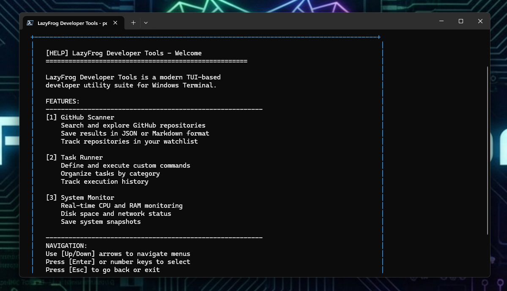

# 🐸 LazyFrog DevTerm

<p align="center">
  
</p>

<p align="center">
  <strong>A keyboard-first terminal utility for developers who stay in the shell</strong>
</p>

<p align="center">
  <a href="https://github.com/PowerShell/PowerShell">
    
  </a>
  <a href="https://www.microsoft.com/windows">
    
  </a>
  <a href="LICENSE">
    
  </a>
</p>

<p align="center">
  <a href="#-features">Features</a> •
  <a href="#-screenshots">Screenshots</a> •
  <a href="#-quick-start">Quick Start</a> •
  <a href="#-usage">Usage</a> •
  <a href="#-documentation">Docs</a> •
  <a href="#-contributing">Contributing</a>
</p>

---

## ✨ Why LazyFrog?

LazyFrog DevTerm keeps your most-used developer tools in one place, right inside the terminal. No more context switching—just keyboard shortcuts and clean output.

- **🔍 Stay in flow** — Common actions are a few keystrokes away
- **⚡ Repeatable work** — Task Runner turns commands into reliable, named actions
- **📊 Fast visibility** — System Monitor shows health without opening heavy tools
- **📁 Simple outputs** — Results saved in JSON/Markdown you can share or track

---

## 🎯 Features

### 🔍 GitHub Scanner
- Search public repositories by keyword and language
- View stars, forks, and last update at a glance
- Save results to JSON or Markdown
- Maintain a local watchlist

### ⚙️ Task Runner
- Execute commands from `tasks.json` with one keystroke
- Group workflows by category
- Review task history
- **Important:** Git tasks must run inside a Git repo folder

### 📊 System Monitor
- Live CPU and RAM usage
- Disk usage per drive
- Network details and uptime

### ❓ Help & Docs
- Built-in help for every module
- Keyboard shortcuts reference
- Output location reminders

---

## 📸 Screenshots

<p align="center">
  
  <br/><em>Main Menu — Clean navigation to all modules</em>
</p>

<p align="center">
  
  <br/><em>GitHub Scanner — Search repos and save results</em>
</p>

<p align="center">
  
  <br/><em>Task Runner — Run common commands with one keystroke</em>
</p>

<p align="center">
  
  <br/><em>System Monitor — Quick health check</em>
</p>

<p align="center">
  
  <br/><em>Help — Built-in docs and keyboard shortcuts</em>
</p>

---

## 🚀 Quick Start

### Prerequisites
- Windows 10/11
- [PowerShell 7+](https://github.com/PowerShell/PowerShell/releases)
- Windows Terminal (recommended)

### Option A: Build & Install (recommended)
```powershell
git clone https://github.com/Brutus1066/LazyFrog-Kindware-DevTerm.git
cd LazyFrog-Kindware-DevTerm
.\installer\build-installer.ps1
.\dist\LazyFrog-DevTerm-Package\Install-LazyFrogDevTerm.ps1
```

### Option B: Run from Source
```powershell
git clone https://github.com/Brutus1066/LazyFrog-Kindware-DevTerm.git
cd LazyFrog-Kindware-DevTerm
pwsh -NoProfile -ExecutionPolicy Bypass -File .\src\main.ps1
```

---

## 🎹 Usage

| Key | Action |
|-----|--------|
| **1–4** | Jump to module |
| **↑/↓** | Navigate |
| **Enter** | Select |
| **Q** | Quit |
| **J** | Save JSON (GitHub) |
| **M** | Save Markdown (GitHub) |
| **Esc** | Back |

---

## 📁 Output Locations

| Data | Path |
|------|------|
| GitHub results | `results/github-search-*.json` or `.md` |
| Task history | `history/task-history.json` |
| Logs | `%LOCALAPPDATA%\LazyFrog-DevTerm\logs` |

---

## 📖 Documentation

| Document | Description |
|----------|-------------|
| [Quick Start](docs/QUICK_START.md) | Get running in 2 minutes |
| [Install](docs/INSTALL.md) | Full installation guide |
| [Usage](docs/USAGE.md) | Module walkthroughs |
| [Troubleshooting](docs/TROUBLESHOOTING.md) | Common issues and fixes |
| [Release Notes](docs/RELEASE-NOTES.md) | What's new |
| [AI Context](docs/AI_CONTEXT.md) | For tooling and assistants |
| [Release Build](release/README.md) | Creating distributable packages |

---

## 📦 Downloads

Get the latest release from [GitHub Releases](https://github.com/Brutus1066/LazyFrog-Kindware-DevTerm/releases):

| Download | Description |
|----------|-------------|
| `LazyFrog-DevTerm-Setup-vX.X.X.exe` | One-click installer (recommended) |
| `LazyFrog-DevTerm-vX.X.X.zip` | Portable package |

---

## 🤝 Contributing

We welcome contributions! See [CONTRIBUTING.md](CONTRIBUTING.md) for guidelines.

Quick ideas:
- 🐛 **Bug fixes** — PRs welcome for any issues
- ✨ **Feature requests** — Open an issue to discuss
- 📝 **Documentation** — Help improve the docs

---

## 📜 License

MIT License — see [LICENSE](LICENSE) for details.

---

## 🙏 Acknowledgments

- PowerShell team for an excellent cross-platform shell
- The terminal enthusiast community

---

<p align="center">
  <strong>LazyFrog DevTerm</strong> | <a href="https://kindware.dev">kindware.dev</a> • <a href="https://github.com/Brutus1066">GitHub</a>
</p>

<p align="center">
  Made with 🐸 for developers who appreciate the command line
</p>
