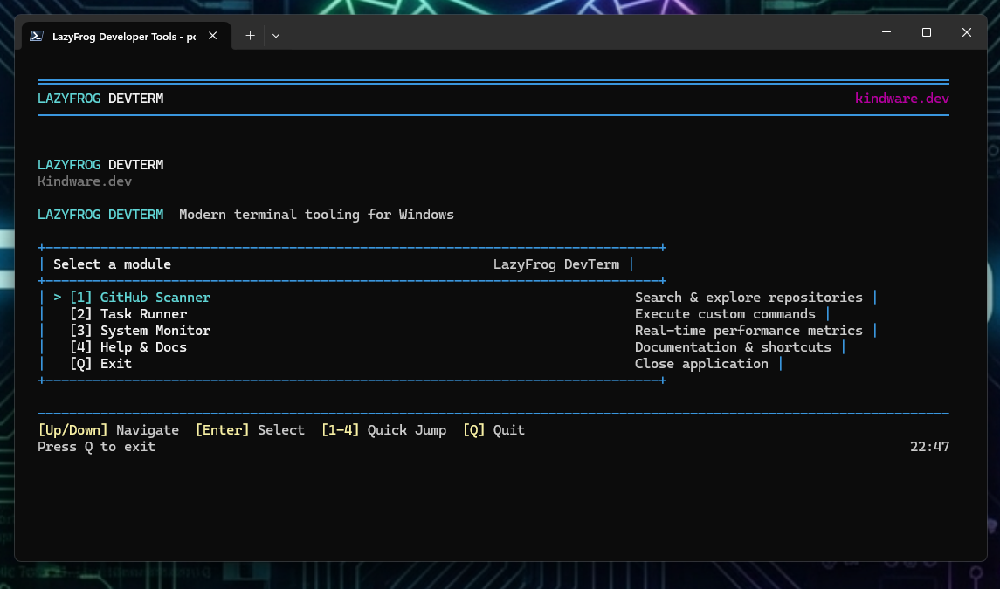
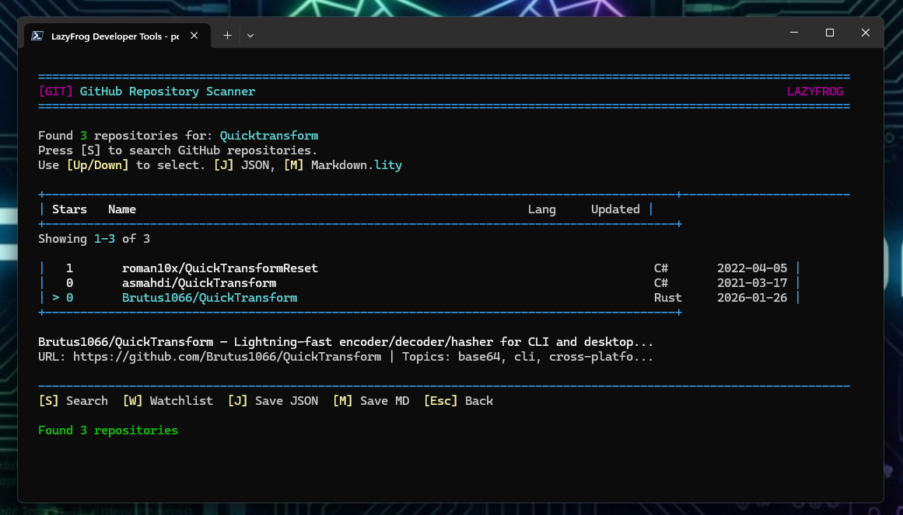
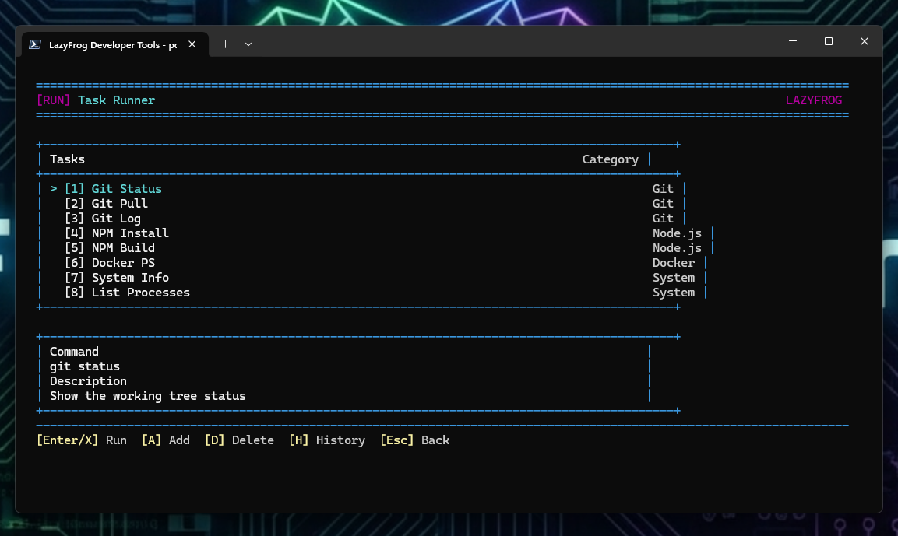
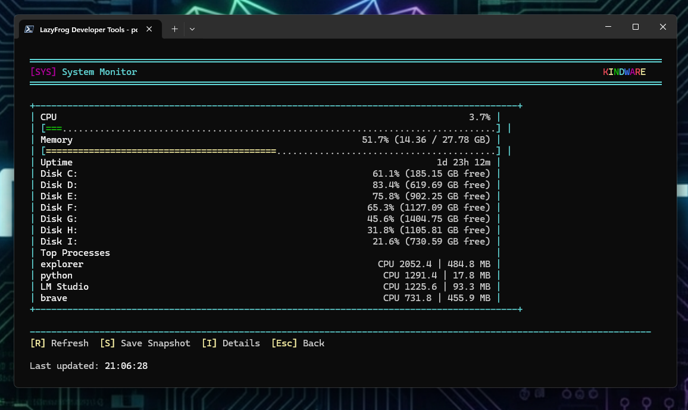

<p align="center">
  
  
  
  
</p>

<h1 align="center">🐸 LazyFrog DevTerm</h1>

<h3 align="center">Modern Terminal Utility Suite for Developers</h3>

<p align="center">
  <em>A keyboard-first TUI for developers who stay in the shell</em>
</p>

```
    ██╗  ██╗██╗███╗   ██╗██████╗ ██╗    ██╗ █████╗ ██████╗ ███████╗
    ██║ ██╔╝██║████╗  ██║██╔══██╗██║    ██║██╔══██╗██╔══██╗██╔════╝
    █████╔╝ ██║██╔██╗ ██║██║  ██║██║ █╗ ██║███████║██████╔╝█████╗
    ██╔═██╗ ██║██║╚██╗██║██║  ██║██║███╗██║██╔══██║██╔══██╗██╔══╝
    ██║  ██╗██║██║ ╚████║██████╔╝╚███╔███╔╝██║  ██║██║  ██║███████╗
    ╚═╝  ╚═╝╚═╝╚═╝  ╚═══╝╚═════╝  ╚══╝╚══╝ ╚═╝  ╚═╝╚═╝  ╚═╝╚══════╝

                    ◆ LazyFrog DevTerm v2.0.0
              ━━━━━━━━━━━━━━━━━━━━━━━━━━━━━━━━━
               🐸 Terminal Utility Suite for Devs
               created by LazyFrog-kz | kindware.dev
```

> **🌈 KINDWARE Rainbow CLI** — PowerShell 7+ with beautiful ANSI colors!

<p align="center">
  <a href="#-features">Features</a> •
  <a href="#-screenshots">Screenshots</a> •
  <a href="#-installation">Installation</a> •
  <a href="#-usage">Usage</a> •
  <a href="#-building">Building</a> •
  <a href="#-contributing">Contributing</a>
</p>

---

<p align="center">
  
</p>

---

## 💡 Why LazyFrog?

**The Problem:** You're constantly switching between terminal, browser, and system tools. Opening Task Manager for a quick health check. Googling for that GitHub repo again. Hunting for that command you ran last week.

**The Solution:** One TUI, all your daily tools. Search GitHub repos, run saved commands, monitor system health — all without leaving the terminal. Keyboard-driven, zero bloat, 100% offline-capable.

```
    ╭─────────────────────────────────────╮
    │  [1] 🔍 GitHub Scanner              │
    │  [2] ⚙️  Task Runner                 │
    │  [3] 📊 System Monitor              │
    │  [4] ❓ Help & Docs                 │
    │  [Q]    Quit                        │
    ╰─────────────────────────────────────╯
```

| | |
|---|---|
| 🔍 **Stay in flow** | Common actions are a few keystrokes away |
| ⚡ **Repeatable work** | Task Runner turns commands into reliable, named actions |
| 📊 **Fast visibility** | System Monitor shows health without opening heavy tools |
| 📁 **Simple outputs** | Results saved in JSON/Markdown you can share or track |

---

## ✨ Features

| Module | Capabilities |
|--------|--------------|
| 🔍 **GitHub Scanner** | Search public repos by keyword/language, view stars/forks, save to JSON/Markdown, maintain watchlist |
| ⚙️ **Task Runner** | Execute commands from `tasks.json` with one keystroke, group by category, review history |
| 📊 **System Monitor** | Live CPU/RAM usage, disk space per drive, network details, uptime |
| ❓ **Help & Docs** | Built-in help for every module, keyboard shortcuts reference, output locations |

### 🎯 Key Highlights

- **Keyboard-first navigation** — Number keys jump to modules, arrow keys navigate, Enter selects
- **Portable & installable** — Use from anywhere or install with desktop/Start Menu shortcuts
- **Icon persistence** — Desktop shortcut icons embedded in EXE, survive reboots
- **Clean TUI design** — Modern borders, colors, and responsive layout
- **Zero dependencies** — Just PowerShell 7+ and you're ready

---

## 📸 Screenshots

<p align="center">
  <table>
    <tr>
      <td align="center">
        <br/>
        <em>Main Menu</em>
      </td>
      <td align="center">
        <br/>
        <em>GitHub Scanner</em>
      </td>
    </tr>
    <tr>
      <td align="center">
        <br/>
        <em>Task Runner</em>
      </td>
      <td align="center">
        <br/>
        <em>System Monitor</em>
      </td>
    </tr>
  </table>
</p>

---

## 📦 Installation

### Option 1: Pre-built Binaries (Easiest)

> **No build required!** Download, extract, and run.

1. Go to [**Releases**](https://github.com/Brutus1066/LazyFrog-Kindware-DevTerm/releases)
2. Download `LazyFrog-DevTerm-Setup-vX.X.X.exe`
3. Run the installer — creates Desktop & Start Menu shortcuts
4. Launch from **LazyFrog DevTerm** shortcut

| File | Description |
|------|-------------|
| `LazyFrog-DevTerm-Setup-vX.X.X.exe` | One-click installer (recommended) |
| `LazyFrog-DevTerm-vX.X.X.zip` | Portable package — extract and run |

### Option 2: Run from Source

```powershell
# Clone the repository
git clone https://github.com/Brutus1066/LazyFrog-Kindware-DevTerm.git
cd LazyFrog-Kindware-DevTerm

# Run directly
pwsh -NoProfile -ExecutionPolicy Bypass -File .\src\main.ps1
```

### Option 3: Build Installer from Source

```powershell
# Clone and build
git clone https://github.com/Brutus1066/LazyFrog-Kindware-DevTerm.git
cd LazyFrog-Kindware-DevTerm\release

# Create release package with EXEs
pwsh -File Build-Release.ps1 -Version "1.2.0"

# Run the installer
.\output\LazyFrog-DevTerm-Setup-v1.2.0.exe
```

### Requirements

| Requirement | Details |
|-------------|---------|
| **OS** | Windows 10/11 (64-bit) |
| **PowerShell** | 7.0+ ([Download](https://github.com/PowerShell/PowerShell/releases)) |
| **Terminal** | Windows Terminal recommended |

---

## 🚀 Usage

### ⌨️ Keyboard Shortcuts

| Key | Action |
|-----|--------|
| **1–4** | Jump directly to module |
| **↑/↓** | Navigate menu items |
| **Enter** | Select / Confirm |
| **Esc** | Go back / Cancel |
| **Q** | Quit application |

### GitHub Scanner Keys

| Key | Action |
|-----|--------|
| **S** | New search |
| **J** | Save results as JSON |
| **M** | Save results as Markdown |
| **W** | Add to watchlist |

### 📁 Data Locations

| Data | Path |
|------|------|
| **App files** | `%LOCALAPPDATA%\LazyFrog-DevTerm\` |
| **GitHub results** | `results/github-search-*.json` or `.md` |
| **Task history** | `history/task-history.json` |
| **Logs** | `%LOCALAPPDATA%\LazyFrog-DevTerm\logs\` |

---

## 🔧 Building

### Build Complete Release Package

The build system creates distributable EXE files with embedded icons:

```powershell
cd release
pwsh -File Build-Release.ps1 -Version "1.2.0"
```

### Build Output

```
release/output/
├── LazyFrog-DevTerm-Setup-v1.2.0.exe   # Installer EXE
├── LazyFrog-DevTerm-v1.2.0.zip         # Portable ZIP
├── README.md                            # Release notes
└── LazyFrog-DevTerm-v1.2.0/            # Package folder
    ├── LazyFrog.exe                     # Launcher (with embedded icon)
    ├── Install-LazyFrogDevTerm.ps1      # PowerShell installer
    ├── src/                             # Application source
    └── docs/                            # Documentation
```

### Build Options

| Flag | Description |
|------|-------------|
| `-Version "X.X.X"` | Set release version |
| `-Clean` | Remove previous build artifacts first |
| `-SkipExe` | Skip EXE creation (for systems without PS2EXE) |

---

## 📊 Technical Details

| | |
|---|---|
| **Language** | PowerShell 7+ |
| **UI Framework** | Native PowerShell TUI (no external dependencies) |
| **EXE Compilation** | PS2EXE (auto-installed during build) |
| **Icon Embedding** | Compiled into EXE at build time |
| **Config Format** | JSON (`config.json`, `tasks.json`) |
| **Offline** | 100% — no telemetry, no network calls (except GitHub API for searches) |

---

## 📖 Documentation

| Document | Description |
|----------|-------------|
| [Quick Start](docs/QUICK_START.md) | Get running in 2 minutes |
| [Installation](docs/INSTALL.md) | Full installation guide |
| [Usage Guide](docs/USAGE.md) | Module walkthroughs |
| [Troubleshooting](docs/TROUBLESHOOTING.md) | Common issues and fixes |
| [Release Notes](docs/RELEASE-NOTES.md) | What's new |
| [Build Guide](release/README.md) | Creating distributable packages |
| [AI Context](docs/AI_CONTEXT.md) | For AI tooling and assistants |

---

## 🤝 Contributing

Contributions are welcome! Please see [CONTRIBUTING.md](CONTRIBUTING.md) for guidelines.

1. Fork the repository
2. Create your feature branch (`git checkout -b feature/amazing`)
3. Commit your changes (`git commit -m 'Add amazing feature'`)
4. Push to the branch (`git push origin feature/amazing`)
5. Open a Pull Request

### Ideas for Contributions

- 🐛 **Bug fixes** — PRs welcome for any issues
- ✨ **New modules** — Add more developer tools
- 🎨 **Themes** — Create color schemes
- 📝 **Documentation** — Improve the docs

---

## 📄 License

MIT License — see [LICENSE](LICENSE) for details.

---

## 🙏 Acknowledgments

- PowerShell team for an excellent cross-platform shell
- PS2EXE for PowerShell-to-EXE compilation
- The terminal enthusiast community

---

<p align="center">
  <em>Made with 🐸 for developers who live in the terminal</em>
</p>

<p align="center">
  <a href="https://kindware.dev">kindware.dev</a>
</p>

<p align="center">
  <a href="https://github.com/Brutus1066/LazyFrog-Kindware-DevTerm/stargazers">⭐ Star this repo</a> if you find it useful!
</p>
